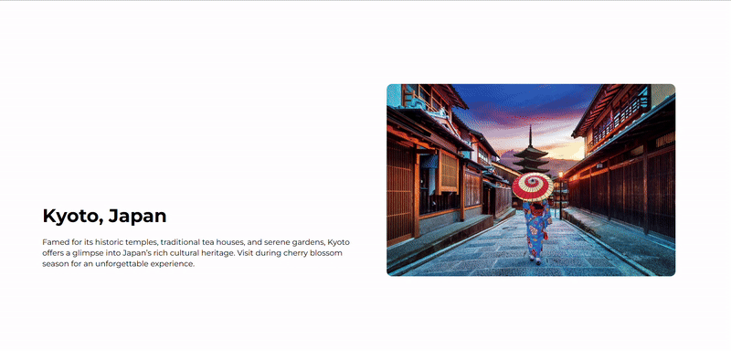
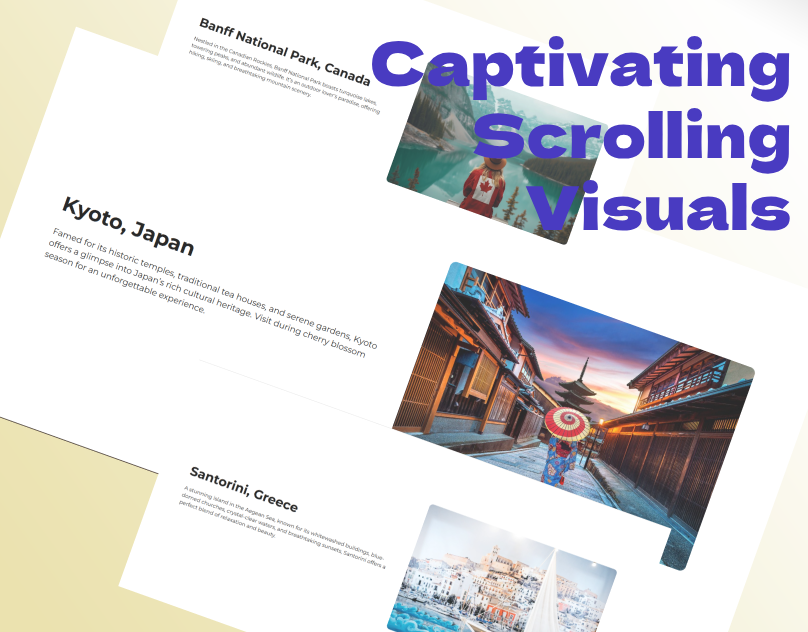

# Captivating Scrolling Visuals

### Author
##### Virendra D. Verma

<a href="https://www.linkedin.com/in/dharmendraverma95/" target="_blank">LinkedIn Profile </a>

<a href="https://www.behance.net/dhirukumar" target="_blank">Behance Profile </a>

# Project Overview

# Scroll-Triggered

Welcome to the Captivating Scrolling Visuals project! This digital presentation showcases a dynamic and engaging visual experience, featuring smooth transitions, interactive designs, and stunning imagery. Perfect for enhancing presentations, portfolios, and websites, it provides an immersive way to present content that captivates audiences and leaves a lasting impression.

## Features
- Dynamic Scrolling: Smooth, seamless transitions to guide your audience through content.
- Engaging Visuals: Stunning imagery designed to captivate and engage.
- Customizable Design: Easily tailored to fit the unique needs of your project.

# Preview
Captivating Scrolling Visuals
 

 
Captivating Scrolling Visuals Start & End Point 
 

 

 
Captivating Scrolling  
 

 

Cover
 

 

### Technologies Used
<ul>
  <li>Graphic Design Software: Adobe Illustrator, Photoshop, Figma (for mockups)</li>
  <li>Web Tools (Optional): HTML5, CSS3 and jQuery for any digital presentations or landing pages</li>
</ul>

### Contribution
Feel free to fork this repository and contribute by submitting pull requests. If you find any bugs or issues, please report them in the Issues section.

###  Acknowledgments
Designed and created with passion for unique visual experiences

